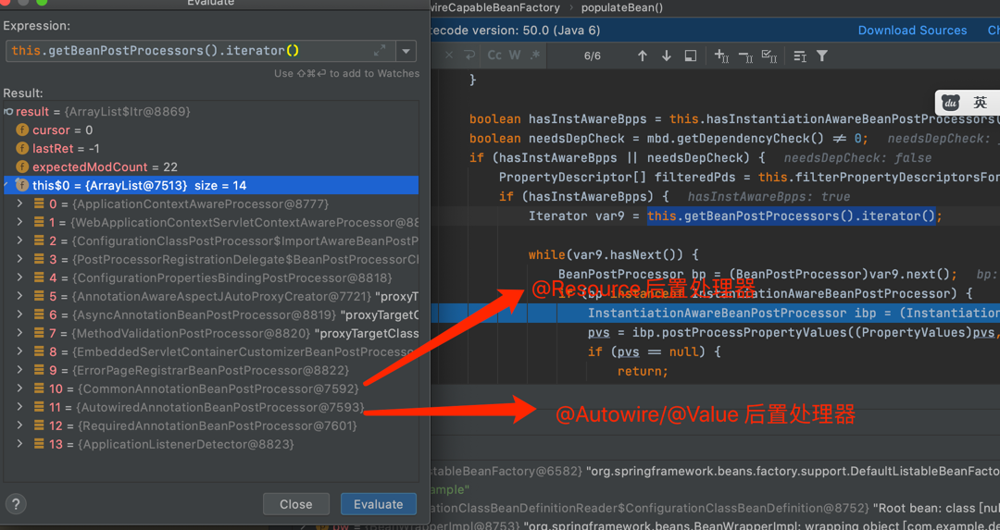
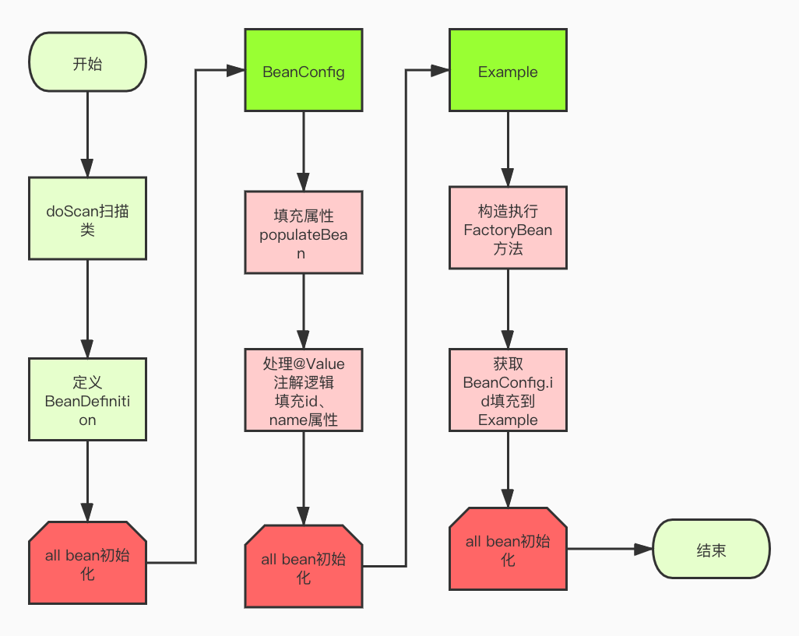
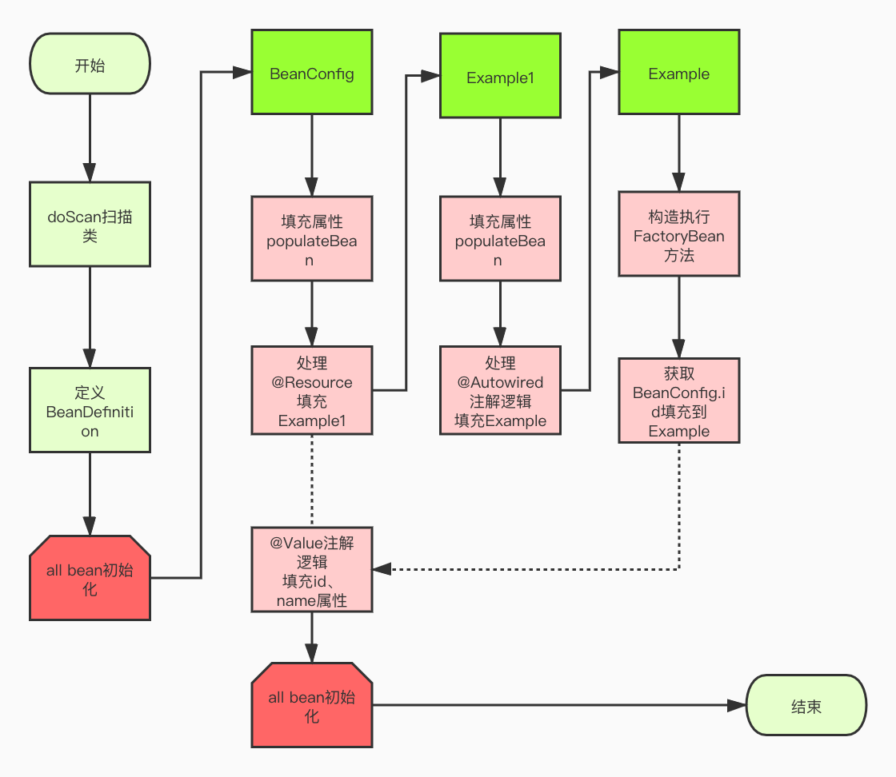
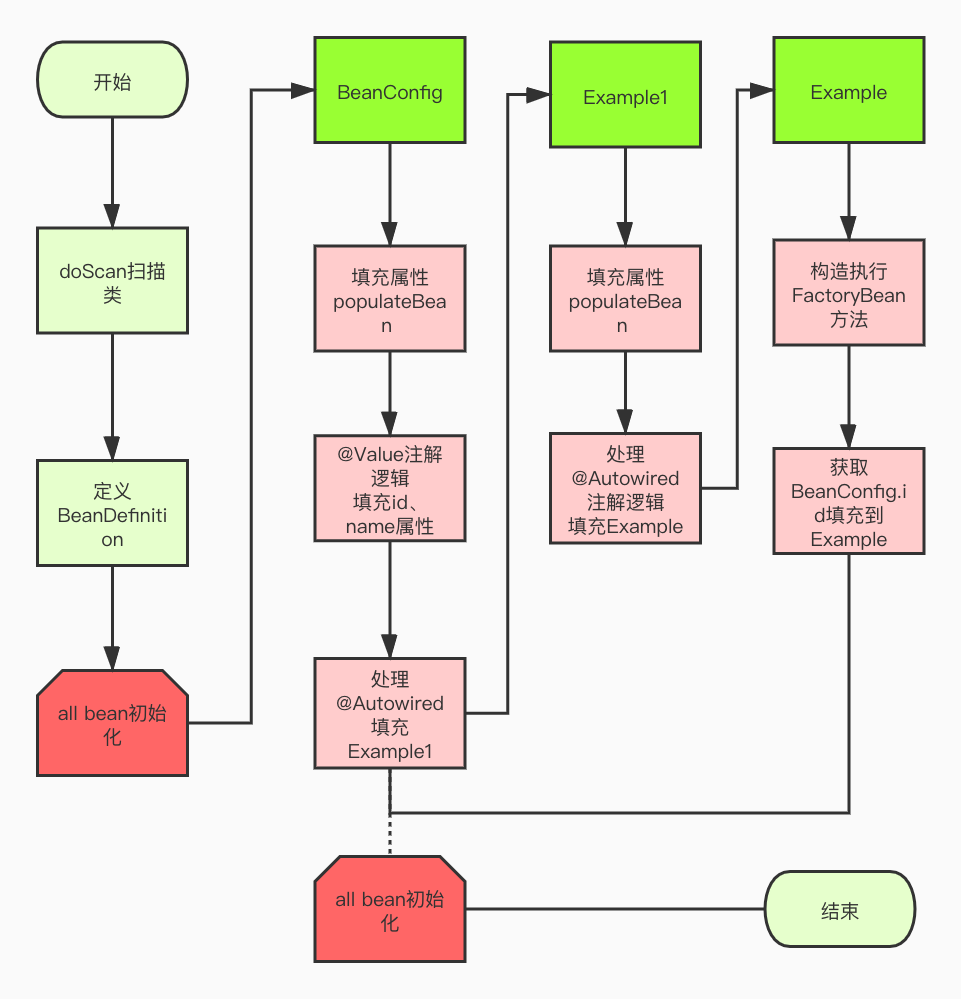

#[@Resource、@Autowired、@Value的循环依赖问题]()

@Resource和@Autowired两个注解大家应该很熟悉，在spring中我们通常使用@Resource和@Autowired做bean的注入时使用。Spring 创建 bean 的流程，即 Spring 先通过反射创建一个原始的 bean 对象，然后再向这个原始的 bean 对象中填充属性。 在Bean实例化时候属性填充 方法入口:`org.springframework.beans.factory.support.AbstractAutowireCapableBeanFactory#populateBean`在populateBean方法中会将业务逻辑交由不同的spring后置处理器(InstantiationAwareBeanPostProcessor==>BeanPostProcessor)。



从图中可知:后置处理器按排序依次执行 `CommonAnnotationBeanPostProcessor 早于 AutowiredAnnotationBeanPostProcessor`


> 不同点：
> + @Resource在Spring填充时机是交由org.springframework.context.annotation.CommonAnnotationBeanPostProcessor#postProcessPropertyValues方法
> + @Autowired在Spring填充时机是交由org.springframework.beans.factory.annotation.AutowiredAnnotationBeanPostProcessor#postProcessPropertyValues方法

###[正常配置bean填充参数]()：
````java
@Component
public class BeanConfig {

    @Value("${id}")
    private String id;
    @Value("${name}")
    private String name;

//    @Resource
//    private Example1 example1;

    @Bean
    public Example example(){
        Example example = new Example();
        example.setId(id);
        example.setName(name);
        return example;
    }
}

public class Example {
    private String id;
    private String name;

    public String getId() {
        return id;
    }

    public void setId(String id) {
        this.id = id;
    }

    public String getName() {
        return name;
    }

    public void setName(String name) {
        this.name = name;
    }

    @Override
    public String toString() {
        return "Example{" +
                "id='" + id + '\'' +
                ", name='" + name + '\'' +
                '}';
    }

}

@RestController
@RequestMapping
public class ExampleController {

    @Autowired
    private Example example;

    @RequestMapping("/example")
    public String example() {
        return example.toString();
    }
}
````

输出结果:
````
Example{id='ide', name='name'}
````

###[循环配置bean填充参数]()

````java
@Component
public class BeanConfig {

    @Value("${id}")
    private String id;
    @Value("${name}")
    private String name;

    @Resource
    private Example1 example1;

    @Bean
    public Example example(){
        Example example = new Example();
        example.setId(id);
        example.setName(name);
        return example;
    }
}

@Component
public class Example1 {

    @Autowired
    private Example example;
}

````
输出结果:

````
Example{id='null', name='null'}
````

如果将 `@Resource` 将修改成 `@Autowired` 
````java
@Component
public class BeanConfig {

    @Value("${id}")
    private String id;
    @Value("${name}")
    private String name;

    @Autowired
    private Example1 example1;

    @Bean
    public Example example(){
        Example example = new Example();
        example.setId(id);
        example.setName(name);
        return example;
    }
}

@Component
public class Example1 {

    @Autowired
    private Example example;
}

````
输出结果又正常了
````
Example{id='ide', name='name'}
````
如果将 `@Autowired` 和 `@Value` 位置对换一下
````java
@Component
public class BeanConfig {

    @Autowired
    private Example1 example1;
    
    @Value("${id}")
    private String id;
    @Value("${name}")
    private String name;

    @Bean
    public Example example(){
        Example example = new Example();
        example.setId(id);
        example.setName(name);
        return example;
    }
}

@Component
public class Example1 {

    @Autowired
    private Example example;
}

````


##BeanConfig类是在什么时候将处理@Bean/@Value/@Resource/@Autowired
AnnotationConfigUtils.registerAnnotationConfigProcessors方法的调用中， 可以看到spring注册了多个与注解处理相关的类，其中包括用于处理@Configuration或@ComponentScan注解配置的类ConfigurationClassPostProcessor

待更新

`@Bean`:相当于定义BeanDefinition 放到BeanDefinitionMap中去，方法名为beanName。

`@Value`:扫描@Component注解类，将类信息存放到放到BeanDefinitionMap中去，然后交由spring容器准备实例化bean
触发属性填充。填充逻辑将在AutowiredAnnotationBeanPostProcessor#postProcessPropertyValues方法

`@Resource`:扫描@Component注解类，将类信息存放到放到BeanDefinitionMap中去，然后交由spring容器准备实例化bean
触发属性填充。填充逻辑将在CommonAnnotationBeanPostProcessor#postProcessPropertyValues方法

`@Autowired`:扫描@Component注解类，将类信息存放到放到BeanDefinitionMap中去，然后交由spring容器准备实例化bean
触发属性填充。填充逻辑将在AutowiredAnnotationBeanPostProcessor#postProcessPropertyValues方法

####所以@Bean类中的初始化流程慢于@Value属性填充。

###正常情况:
这种情况很常用，比如平时使用config类 注入一些外部配置类如:kafka、redis、dubbo、邮箱信息。


###@Resource异常情况:
当类之间存在依赖关系时，就会可能存在异常。这一种情况比较隐秘，可能存在多级依赖，不容易发现。一般情况配置mq config信息会出现。



这是因为`CommonAnnotationBeanPostProcessor 早于 AutowiredAnnotationBeanPostProcessor` Example会先初始化后再执行@Value填充参数逻辑，导致Example参数为空。

###@Autowired正常情况:



###@Autowired异常情况:


`@Value`和`@Autowired` 都将在填充逻辑将在`AutowiredAnnotationBeanPostProcessor`后置处理器处理逻辑, `AutowiredFieldElement.inject()`方法
AutowiredFieldElement生成逻辑在`AutowiredAnnotationBeanPostProcessor#findAutowiringMetadata`中执行`AutowiredAnnotationBeanPostProcessor#buildAutowiringMetadata`
然后根据代码位置依次排序生成`AutowiredFieldElement`。

代码如下:
````java
public class AutowiredAnnotationBeanPostProcessor extends InstantiationAwareBeanPostProcessorAdapter
        implements MergedBeanDefinitionPostProcessor, PriorityOrdered, BeanFactoryAware {
    
    
    private InjectionMetadata buildAutowiringMetadata(final Class<?> clazz) {
        LinkedList<InjectionMetadata.InjectedElement> elements = new LinkedList<InjectionMetadata.InjectedElement>();
        Class<?> targetClass = clazz;

        do {
            final LinkedList<InjectionMetadata.InjectedElement> currElements =
                    new LinkedList<InjectionMetadata.InjectedElement>();
            //获取字段上的注解
            ReflectionUtils.doWithLocalFields(targetClass, new ReflectionUtils.FieldCallback() {
                @Override
                public void doWith(Field field) throws IllegalArgumentException, IllegalAccessException {
                    //循环依次获取注解信息
                    AnnotationAttributes ann = findAutowiredAnnotation(field);
                    if (ann != null) {
                        if (Modifier.isStatic(field.getModifiers())) {
                            if (logger.isWarnEnabled()) {
                                logger.warn("Autowired annotation is not supported on static fields: " + field);
                            }
                            return;
                        }
                        boolean required = determineRequiredStatus(ann);
                        currElements.add(new AutowiredFieldElement(field, required));
                    }
                }
            });
            //获取方法上的注解
            ReflectionUtils.doWithLocalMethods(targetClass, new ReflectionUtils.MethodCallback() {
                @Override
                public void doWith(Method method) throws IllegalArgumentException, IllegalAccessException {
                    Method bridgedMethod = BridgeMethodResolver.findBridgedMethod(method);
                    if (!BridgeMethodResolver.isVisibilityBridgeMethodPair(method, bridgedMethod)) {
                        return;
                    }
                    AnnotationAttributes ann = findAutowiredAnnotation(bridgedMethod);
                    if (ann != null && method.equals(ClassUtils.getMostSpecificMethod(method, clazz))) {
                        if (Modifier.isStatic(method.getModifiers())) {
                            if (logger.isWarnEnabled()) {
                                logger.warn("Autowired annotation is not supported on static methods: " + method);
                            }
                            return;
                        }
                        if (method.getParameterTypes().length == 0) {
                            if (logger.isWarnEnabled()) {
                                logger.warn("Autowired annotation should only be used on methods with parameters: " +
                                        method);
                            }
                        }
                        boolean required = determineRequiredStatus(ann);
                        PropertyDescriptor pd = BeanUtils.findPropertyForMethod(bridgedMethod, clazz);
                        currElements.add(new AutowiredMethodElement(method, required, pd));
                    }
                }
            });

            elements.addAll(0, currElements);
            targetClass = targetClass.getSuperclass();
        }
        while (targetClass != null && targetClass != Object.class);

        return new InjectionMetadata(clazz, elements);
    }

    private AnnotationAttributes findAutowiredAnnotation(AccessibleObject ao) {
        if (ao.getAnnotations().length > 0) {
            for (Class<? extends Annotation> type : this.autowiredAnnotationTypes) {
                AnnotationAttributes attributes = AnnotatedElementUtils.getMergedAnnotationAttributes(ao, type);
                if (attributes != null) {
                    return attributes;
                }
            }
        }
        return null;
    }
    
}


````


