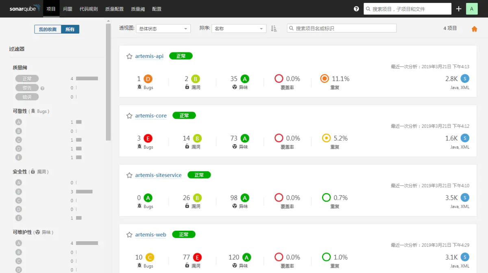
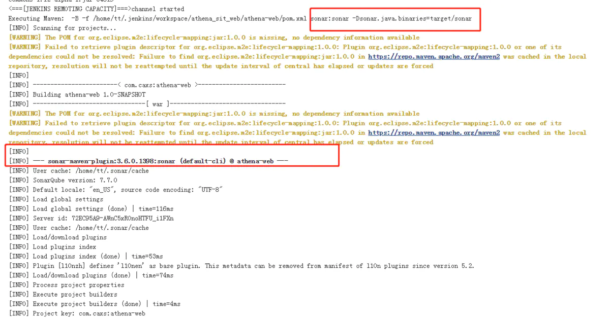

#sonarqube搭建超级完整版

本文重点说明sonarqube的使用和搭建,以及集成到Jenkins，从因到果进行详细的说明。gitLab+Jenkins的安装不在范围内。

从如下几个维度给大家介绍sonarqube

0、前言

CodeReview能带来什么？

CodeReview能解决那些问题？

1、sonarqube是什么？

2、sonarqube 的架构

3、sonarqube的集成

4、windows如何安装

5、linux如何安装?

6、sonarqube集成到Jenkins中

7、IDEA中sonarLint如何使用

##前言

今天你 code review了吗？

[白眼黑脸]表情回答：工作那么多，今天做代码审查，是不可能做代码审查的......

为什么不做代码审查呢？

[白眼黑脸愤怒]表情回答：有多少代码要写，心里没点B数吗？

哈哈哈。。。估计说出了我广大中国IT人民的内心话，接下来就让我们解放生产力，轻松撸代码，轻松回个家。

##CodeReview能带来什么？
````
1、让个人变的优秀 ：程序猿成长的阶梯，促进工程师日常代码交流和快速稳步成长。

2、让团队变的强大：让新人密集型团队、创新型团队凝聚一股敦实的技术力量，有益于团队知识分享与合作，增加团队战斗力。

3、让公司IT技术稳健：为未来公司长远战略目标打下夯实的技术基石。
````


##CodeReview能解决那些问题？
````
1、生产服务不稳定，火灾频繁。

2、代码债务重，后续入职人员将错就错，项目不受控。

3、bug依赖测试团队发现，质量和效率低下。

4、团队成员年轻，水平参差不齐。项目急任务重没有时间。
````

##1、sonarqube是什么？

SonarQube 官网：https://www.sonarqube.org/

````
Sonar (SonarQube)是一个开源平台，用于管理源代码的质量。 Sonar 不只是一个质量数据报告工具，更是代码质量管理平台。 支持java, JavaScrip, Scala 等等二十几种编程语言的代码质量管理与检测。 SonarQube®是一种自动代码审查工具，用于检测代码中的错误，漏洞和代码异味。它可以与您现有的工作流程集成，以便在项目分支和拉取请求之间进行连续的代码检查。
````


##2、sonarqube 的架构


````
1、SonarQube Server 包含3个主要服务进程①WebServer②SearchServer使用elastic search 做为搜索的工具ui ③ComputeEngineServer 分析并且保存到sonar数据库中

2、SonarQube Database ① 配置实例项、插件安装等 ② 项目质量快照视图

3、SonarQube Plugins 各种插件：如 语言插件、认证插件、编程语言检查插件等

4、SonarQube Scanners 分析项目的工具
````

##3、sonarqube 的集成

````
1、在IDE中使用sonarlint插件运行本地分析

2、开发者将代码提交到scm工具中

3、持续集成工具自动触发检查代码执行SonarQube Scanner 运行sonarqube分析

4、分析报告传递给sonarqube server进行加工处理

5、进行处理分析、将数据保存到数据库中、将效果通过ui展示出来

6、开发者通过sonarqube ui查看自己的bug和技术债等

7、项目经理、运维经理、测试经理、开发人员通过代码报表进行查看管理
````

##4、windows如何安装
###步骤一：准备工作

````
1、jdk1.8、maven-3.6.0

2、sonarqube下载地址：

https://binaries.sonarsource.com/Distribution/sonarqube/sonarqube-7.6.zip

3、Sonar Scanner扫描下载

https://binaries.sonarsource.com/Distribution/sonar-scanner-cli/sonar-scanner-cli-3.3.0.1492-windows.zip

4、mysql数据库（5.7）
````

###sonarqube安装和配置篇
1、下载好sonarqube后，解压打开bin目录，启动相应OS目录下的StartSonar。如本文演示使用的是win的64位系统，则打开E:\sonar\sonarqube-7.6\bin\windows-x86-64\StartSonar.bat


2.启动浏览器，访问http://localhost:9000，如出现下图则表示安装成功。


3、修改sonar.properties文件，添加mysql连接信息配置。E:\sonar\sonarqube-7.6\conf\sonar.properties【url是数据库连接地址，username是数据库用户名，jdbc.password是数据库密码，login是sonarqube的登录名，sonar.password是sonarqube的密码】
````
//数据库地址

sonar.jdbc.url=jdbc:mysql://10.10.8.31:3306/sonar?useUnicode=true&characterEncoding=utf8&rewriteBatchedStatements=true&useConfigs=maxPerformance

sonar.jdbc.username=sonar

sonar.jdbc.password=sonar

sonar.sorceEncoding=UTF-8

//sonar登录用户

sonar.login=admin

sonar.password=admin

````

4、重启sonarqube服务，再次访问http://localhost:9000，会稍微有点慢，因为要初始化数据库信息。windows重启方法：在资源管理器中关闭所有的java.exe进程，然后重新运行StartSonar.bat文件；访问地址进行登录，初始的账号密码是：admin/admin，数据库有初始化的表信息。


5、插件安装chinese Pack，安装中文语言包


6、安装好插件重启sonar，登录后如下


###步骤三：sonar-scanner安装和配置篇

1、解压sonar-scanner，配置环境变量

````
A：新建环境变量：SONAR_SCANNER_HOME、值：E:\sonar\sonar-scanner-3.3.0.1492

B：打开path，添加%SONAR_SCANNER_HOME%\bin;

C：cmd进入，输入sonar-scanner -v 出现如下为设置成功
````

2、修改settings.xml文件，E:\CFS\outTool\apache-maven-3.6.0\conf\settings.xml
````
<pluginGroups>

<pluginGroup>org.sonarsource.scanner.maven</pluginGroup>

 </pluginGroups>

</profiles>
  <profile>
      <id>sonar</id>

      <activation>

        <activeByDefault>true</activeByDefault>

      </activation>

      <properties>

       <sonar.jdbc.url>jdbc:mysql://10.10.8.31:3306/sonar</sonar.jdbc.url>

        <sonar.jdbc.driver>com.mysql.jdbc.Driver</sonar.jdbc.driver>

        <sonar.jdbc.username>sonar</sonar.jdbc.username>

        <sonar.jdbc.password>sonar</sonar.jdbc.password>

        <sonar.host.url>http://10.10.7.67:9000/</sonar.host.url>

      </properties>

    </profile>

 </profiles>
````

3、项目maven Reimport后，必须编译项目后才能分析target目录下class文件。执行clean install sonar:sonar，进行代码扫描分析

A：idea中配置快捷键


B：项目控制台出现如下为分析执行完毕


4、刷新 http://localhost:9000  ，点击项目模块出现如下分析结果



##前端代码检查

项目根目录新增配置文件：sonar-project.properties

配置详细：

````
# must be unique in a given SonarQube instance

sonar.projectKey=Artemis-front

# this is the name displayed in the SonarQube UI

sonar.projectName=Artemis-front

sonar.projectVersion=1.0

# Path is relative to the sonar-project.properties file. Replace "\" by "/" on Windows.

# Since SonarQube 4.2, this property is optional if sonar.modules is set.

# If not set, SonarQube starts looking for source code from the directory containing

# the sonar-project.properties file.

sonar.sources=.

在根目录运行命令：sonar-scanner
````

##5、linux如何安装?

###准备工作
````
1、下载 SonarQube和Sonar scanner

SonarQube： http://www.sonarqube.org/downloads/

Sonarscanner： https://docs.sonarqube.org/display/SCAN/Analyzing+with+SonarQube+Scanner（与jenkins在一台服务器）

FTP上传，然后解压 unzip  XXX

2、安装mysql数据库
````

###配置环境变量

进入配置文件：vi /etc/profile
配置文件生效：source /etc/profile

````
SONAR_HOME=/home/sonar/sonarqube-7.7

export SONAR_HOME

SONAR_RUNNER_HOME=/home/sonar/sonar-scanner-3.3.0.1492-linux

PATH=$SONAR_RUNNER_HOME/bin:$PATH

export SONAR_RUNNER_HOME

export JAVA_HOME=/usr/local/jdk1.8

PATH=$JAVA_HOME/bin:$PATH:$HOME/.local/bin:$HOME/bin

````

````
#/etc/security/limits.conf 添加如下配置：

* soft nofile 65536

* hard nofile 131072

* soft memlock unlimited

* hard memlock unlimited

#/etc/sysctl.conf  添加如下配置：

vm.max_map_count=655360
````
````
#配置数据库 vi sonarqube-7.7/conf/sonar.properties

sonar.jdbc.username=sonar

sonar.jdbc.password=sonar

sonar.jdbc.url=jdbc:mysql://10.10.8.11:3306/sonar?useUnicode=true&characterEncoding=utf8&rewriteBatchedStatements=true&useConfigs=maxPerformance&useSSL=false
````

###开启防火墙，开放9000端口


##启动服务
````
./sonar.sh start

重启服务：./sonar.sh restart

停止服务：./sonar.sh stop

访问http://10.10.8.12:9000/
````


##查看数据库


###插件安装chinese Pack，安装中文语言包


安装好插件重启sonar，登录后如下


##6、jenkins集成sonarQube

1.在jenkins中安装SonarQube Scanner 插件 

系统管理--》插件管理--》


2.在配置页对SonarQube servers进行配置:

系统配置–系统设置–SonarQube servers


访问sonarqube进行token生成

配置--》权限


账号--》我的账号


token一定保存：c5bc5fe7b18600d8a8efb5af5ace7383c7ca00f0，在jenkins中会配置用到

###系统管理--》全局工具配置 sonarqube scanner配置


###maven项目配置

在maven的/home/tt/apache-maven-3.5.3/conf/setting配置文件添加如下配置
````
<pluginGroups>

    <pluginGroup>org.sonarsource.scanner.maven</pluginGroup>

  </pluginGroups>

</profiles>

  <profile>

            <id>sonar</id>

            <activation>

                <activeByDefault>true</activeByDefault>

            </activation>

            <properties>

              <sonar.jdbc.url>jdbc:mysql://10.10.8.11:3306/sonar</sonar.jdbc.url>

                <sonar.jdbc.driver>com.mysql.jdbc.Driver</sonar.jdbc.driver>

                <sonar.jdbc.username>sonar</sonar.jdbc.username>

                <sonar.jdbc.password>sonar</sonar.jdbc.password>

                <sonar.host.url>http://10.10.8.12:9000/</sonar.host.url> <!-- sonarqube地址

            </properties>

        </profile>

  </profiles>
````

###在项目的pom文件中加入sonar-maven-plugin
````
<dependency>

    <groupId>org.sonarsource.scanner.maven</groupId>

    <artifactId>sonar-maven-plugin</artifactId>

    <version>3.6.0.1398</version>

</dependency>
````

###jenkins项目配置的Build中加入启动参数

直接把sonar.java.binaries指向项目自动生成的target/sonar目录。
````
mvn sonar:sonar -Dsonar.java.binaries=target/sonar -Dmaven.test.skip=true
````


###jenkins中立即构建项目




啊哈哈哈。。。。终于完事儿了。。。看看成果


###jenkins前端项目分析


###问题

SonarQube scanner exited with non-zero code: 1


##7、IDEA中sonarLint如何使用 

###一、IDEA如何安装SonarLint插件
````
1.打开 Idea

2.点击【File】

3.点击【Settings】

4.点击【Plugins】

5.在搜索栏中输入“sonarlint”关键字

6.点击【Install】进行安装

7.重启Idea
````


###二、IDEA如何连接Sonar服务器

````
1.打开 Idea

2.点击【File】→【Settings】

3.选择【SonarLint General Settings】

4.点击【+】

5.ConfigurationName：请输入连接名，如SonarQube

6.Choosea Connection Type：sonarqube

7.SonarQubeURL：http://xxxx

8.AuthenticationType：Login/Password

•Login：请输入sonar系统登录用户名

•Password：请输入sonar系统登录密码

9.点击【Next】，提示连接成功

````


###三、IDEA中SonarLint如何进行代码扫描
````
扫描整个工程

1.打开 IDEA

2.右击项目名称，如jar-kdc-api

3.点击【SonarLint】

4.点击【AnalyzeAll Files with SonarLint】

5.弹出确认窗口，点击【Proceed】继续

6.【SonarLint Analysis】窗口会显示扫描进度

扫描单个文件

打开单个文件，sonarlint会自动进行sonar扫描
````


###IDEA中SonarLint如何关联sonar已有项目
````
1.打开Idea

2.依次点击【File】→【Settings】→【OtherSettings】→【SonarLint Project Settings】

3.Bindto server：选择之前的sonar连接名，如SonarQube

4.点击【Updateproject list】，下载Sonar所有项目列表

5.在【SonarQubeproject】中选择sonar对应的项目名，如jar-kdc-api，点击【OK】完成关联

点击SonarLint Project Settings,勾选Enable binding to remote SonarQube server,并选择Bind to server，选择你刚添加的sonarqube server。点击OK，关闭窗口即可。
````


彩蛋连接：

sonar表关系：

http://www.cnblogs.com/zishi/p/7510072.html

sonar rule：

https://www.cnblogs.com/tongxuping/p/7838702.html

https://blog.csdn.net/zhuangchuanao/article/details/82893762

sonar质量阀

https://www.jianshu.com/p/113f6ef9bb0a

邮箱设置

https://www.cnblogs.com/LearningLog/p/9018371.html

https://blog.csdn.net/liunianxiluo/article/details/88124981

https://my.oschina.net/u/2254503/blog/639034

链接：https://www.jianshu.com/p/b35674bd2fad