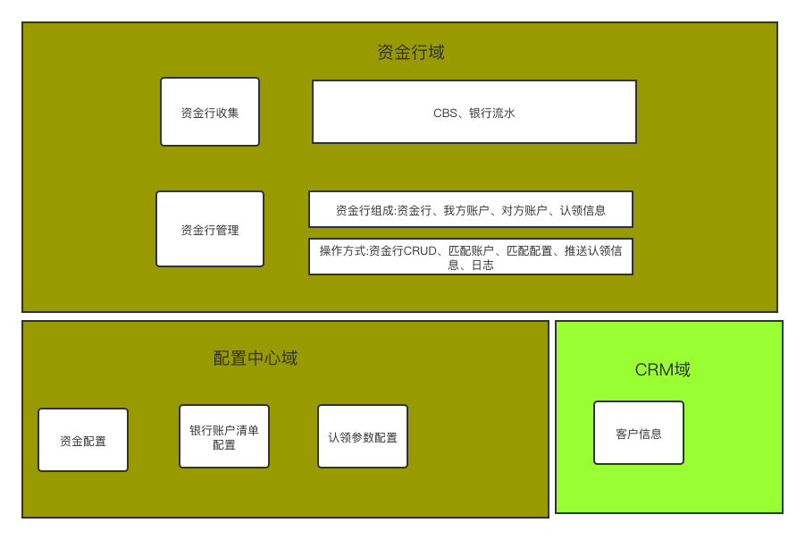
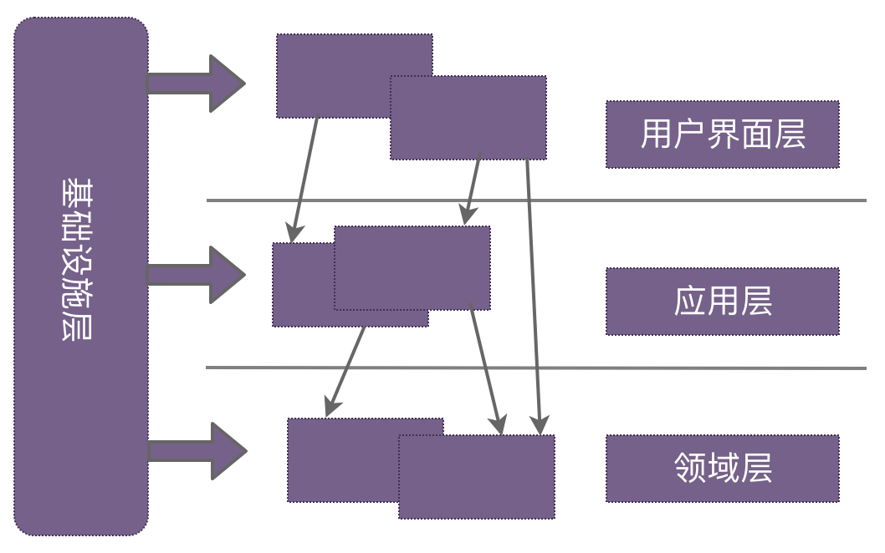
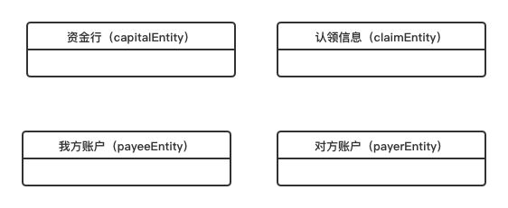

#领域模型设计(DDD)资金认领的实践

#一、项目背景
> + 从CBS获取客户对涂鸦的收款记录，通过银行流水中的涂鸦银行账号、客户付款账号关联资金账户信息、客户信息
> + 通过资金自动认领配置表，对资金账户、客户信息匹配成功的数据进行认领操作
> + 自动推送资金认领数据到SAP生成对应的凭证 
##1.1需求目标
> + 实现付款流水的自动认领
> + 实现手动上传的流水的手动认领
> + 认领成功自动生成SAP接口
 
整个项目分为两大业务域，分别是资金行域、配置中心域。其中，资金行域主要负责资金行收集、资金行管理等功能；配置中心域负责管理一些公共配置资源

图1-1 资金认领总览图

#二、领域驱动基础概念介绍

在介绍DDD相关基础概念前，我先说明下为什么要使用DDD？在非DDD设计思路下的项目，我们一般先根据需求做数据库表的设计，然后根据表结构设计推导出相应的实体对象，这样的实体对象是数据模型转换的结果。此时，这些对象只是数据的载体，是没有行为的。在这种设计模式下，业务流程实现上仍旧是面向过程式，是一种以数据为中心的过程式思想，其开发过程可以理解为是对数据移动、处理和实现的过程。而如果采用DDD的思想去设计，我们将建立一个基于面向对象设计的系统。接下来，我先介绍DDD的标准分层架构，然后介绍下需求分析阶段非常有用的四色原型分析模式，最后简要介绍下方案设计阶段常用到的几个DDD领域概念。

##2.1 领域驱动设计标准分层架构

图2-1 领域驱动架构模型

###2.1.1 基础设施层
基础设施层主要为其他层提供通用的技术能力，比如，应用的消息发送、领域持久化等。在实际的项目应用中，本层主要用于持久化数据的读取和写入，我们可以在这一层，将需要持久化的领域对象序列化到指定的存储介质中，比如：数据库、Hbase、MongoDB、ES等，同理，亦可从这些存储介质中取出数据并组装成领域对象。在这一层，一般会采用仓储机制实现领域持久化能力。
###2.1.2 领域层
###2.1.3 应用层
###2.1.4 用户界面层
###2.1.5应用工程结构简单介绍

##2.2 需求分析利器 — 四色原型图
简单的业务需求，一般使用用例图就可以表述清楚了，如果业务再复杂一些，我们可以附加一些时序图、状态图等加以说明，但是当业务非常复杂时，怎么去寻找业务中的关键点以及各个点之间的联系呢？或者有没有一个比较科学的理论，指引我们去分析呢？我们可以考虑使用四色原型分析模式。它主要用于业务分析阶段，用来分析业务行为、参与对象、业务对象关系等。那什么是四色原型图呢？我们先来看下它的四个构成元素，具体如下：

（1）时刻-时间段原型（Moment-Interval Archetype）

生日期、行为人；租房行为是在一段时间内发生的，它有开始、结束时间和退租行为。这些我们都是可以通过此原型来表达的。在画原型图时，采用粉红色表示。

（2）参与方-地点-物品原型（Part-Place-Thing Archetype）

原型简称PPT，用来表示参与某个活动的人或物，地点则是活动的发生地。比如签署租房合同这个行为，合同、承租人分别对应这里的物、人，中介办公室对应这里的地点。在画原型图时，使用绿色表示。

（3）描述原型（Description Archetype）

原型简称DESC，是对PPT公共属性的描述，拿“签署租房合同”这个场景为例，在合同中会有一些租期、租金、押金、违约条件等约定，这些约定信息便可采用DESC原型来描述。绘制原型图时，采用蓝色表示。

（4）角色原型（Role Archetype）

原型简称Role，这里的角色，就是我们平时所理解的“身份”。以“签署租房合同”这个场景为例，签署行为人有承租人和中介工作人员，这里的角色便是指“承租人”和“中介工作人员”。绘制原型图时，采用黄色表示。

总结：如果必须要用一句话来概括四色原型的话，那就是：一个什么样的人或物以某种角色在某个时刻或某段时间内在某个地点参与某个活动。 其中“什么样的”就是DESC，“人或物”、“地点”就是PPT，“角色”就是Role，而”某个时刻或某段时间内的某个活动"就是MI。

##2.3 DDD几个核心领域概念

###2.3.1 实体
实体是一个具有身份和连贯性的概念，它具有以下几个特征： - 实体是数据（属性）和行为（业务逻辑关系）的结合体； - 每个实体都有自己的唯一标识，判断两个实体对象是否相等，是通过唯一标识来判断的。比如，两个实体对象，如果唯一标识相等，即使其他属性不相等，这两个实体也会认为是同一个。实体的其他属性不相等，表征的是同一个实体在其生命周期的不同阶段。 - 实体的唯一标识属性值是不可变的，其他属性值是可变的。

举个例子简单说明下，比如在有赞精选内容平台（类似于小红书的电商导购平台）这个业务域中，每一篇“博文”就是一个业务实体，可以采用“博文id”作为实体的唯一标识，然后这个博文实体拥有着属性（标题、作者、发表时间、内容等）和行为（更新博文、删除博文、关联导购商品等），同时，属性是会随着行为而不断变化的。

###2.3.2 值对象
值对象一般会作为一个属性存放于一个实体内部，它具有以下几个特征： - 值对象不需要唯一标识，判断两个值对象是否相等，是通过值对象内部所有属性值是否相等来判断的。 - 值对象的属性值是不允许变化的，即值对象的实体在创建之后就不会变了，如果要改变其属性值，就需要先把此对象删除，然后重新创建一个新对象。

同样以“有赞精选内容平台”为例说明下，用户可以针对博文发起留言，同时，我们会精选出一些留言置顶，对于“置顶的留言”我们可以定义为值对象，并将其作为一个属性放置于博文实体中，一旦置顶留言发生变化，我们只需要将新的置顶留言重建为值对象，并赋值给博文实体的这个属性即可。

###2.3.3 聚合
聚合是一组具有内聚关系的领域对象（包括实体和值对象）的集合，这里的一组可以是一个或多个实体。每个聚合都会有一个根实体（亦称聚合根），它主要用来和外界交互，即外部对象如果想访问聚合内的实体，必须先访问聚合根，然后聚合根再和内部要访问的实体进行交互。

除了内聚性和一致性，聚合根还有以下特征：

* 聚合根的实现应该与框架无关：既然DDD讲求业务复杂度和技术复杂度的分离，那么作为业务主要载体的聚合根应该尽量少地引用技术框架级别的设施，最好是POJO。试想一下，如果你的项目哪天需要从Spring迁移到Play，而你可以自信地给老板说，直接将核心Java代码拷贝过去即可，这将是一种多么美妙的体验。又或者说，很多时候技术框架会有“大步”的升级，这种升级会导致框架中API的变化并且不再支持向后兼容，此时如果我们的领域模与框架无关，那么便可做到在框架升级的过程中幸免于难。

* 聚合根之间的引用通过ID完成：在聚合根边界设计合理的情况下，一次业务用例只会更新一个聚合根，此时你在该聚合根中去引用另外聚合根的整体有什么好处呢？在本文示例中，一个Order下的OrderItem引用了ProductId，而不是整个Product。

* 聚合根内部的所有变更都必须通过聚合根完成：为了保证聚合根的一致性，同时避免聚合根内部逻辑向外泄露，客户方只能将整个聚合根作为统一调用入口。

* 如果一个事务需要更新多个聚合根，首先思考一下自己的聚合根边界处理是否出了问题，因为在设计合理的情况下通常不会出现一个事务更新多个聚合根的场景。如果这种情况的确是业务所需，那么考虑引入`消息机制`和`事件驱动架构`，保证一个事务只更新一个聚合根，然后通过消息机制异步更新其他聚合根。

* ~~聚合根不应该引用基础设施。~~

* 外界不应该持有聚合根内部的数据结构。

尽量使用小聚合。

###2.3.4 仓储
首先说明下仓储被设计出来的初衷，在领域模型中，对象被创建出来后一般会在内存中活动，待其不活动了后，需要将其进行持久化存储。然后，当我们需要重建对象时，需要根据对象当前状态进行重建。可见这整个过程中，会频繁的与数据库（广义的数据库，包括关系型数据库、NoSql数据库等）打交道，进行对象的创建、组装等。因而，能否提供一种机制，帮助我们管理领域对象以及做对象持久化，仓储并应运而生了。

仓储，又称资源库，它具有以下几个特征： - 仓储是连接领域层和基础设施层的桥梁，一般将仓储接口定义放在领域层，仓储的具体实现放在基础设施层。这样做的好处是：解耦了领域层与ORM之间的联系，任何ORM相关的变更，只需要修改仓储的实现便可，对于领域层仓储接口的定义一般是不需要做修改的。 - 仓储里面存储的对象一定是聚合，因为领域模型中都是以聚合来划分业务边界的，所以在实际应用中，我们只会对聚合设计仓储。同理，我们在仓储中做数据更新、删除等操作时，应该以聚合为单位进行操作，而不是仅操作聚合中的某一个实体。

##三、DDD实战

结合四色原型图，设计领域模型的步骤可概括为以下几步：
* 根据需求，采用四色原型分析法建立一个初步的领域模型；
* 进一步分析领域模型，识别出哪些是实体，哪些是值对象，哪些是领域服务；
* 对实体、值对象进行关联和聚合，提炼出聚合边界和聚合根；
* 为聚合根设计仓储（一般情况下，一个聚合分配一个仓储），同时，思考实体、值对象的创建方式，是通过工厂创建，还是直接通过构造函数；
走查需求场景，验证设计的领域模型的合理性。
###3.1 场景分析提炼四色原型图
###3.2 领域模型中实体/值对象/领域服务/聚合识别

一般来说，可以将四色原型图中的原型和DDD做简单的映射，比如：PPT原型描述的是某个活动下的唯一个体，其可对应到DDD中的实体；Role原型表述的是实体在不同状态下的表现，一般将其放置于实体中，一起构成一个完整的带状态实体；DESC原型描述的是PPT的公共属性，一般作为值对象存储；MI原型描述的是某个活动，可间接对应领域服务。

线索域实体
 

接着，我们进一步分析实体间的关系，提炼出聚合边界和聚合根，并定义出仓储。

在资金行域中，资金行是核心，很明显capitalEntity与claimEntity、payerEntity、payeeEntity是相关联的，而后三者间是没有联系的。首先，来看下capitalEntity和payerEntity、payeeEntity，资金行在创建之初是需要强制绑定我方账户和对方账户，而我方账户和对方账户脱离资金行是不具有存在价值的。同时，本项目中，我方账户和对方账户仅作为资金行的归属属性存在，最终我们将payerEntity和payeeEntity（改名为payerVO和payeeVO）作为值对象放置于capitalEntity内，且令资金行信息实体为聚合根；然后，分析下capitalEntity与claimEntity、payerEntity、payeeEntity，主要从两个方面考虑是否需要组成聚合：

（1）聚合代表的是一个完整的概念，具有内部一致性，即聚合内的对象要么一起获取，要么一起更新，要么一起删除。假如聚合在被保存时，内部任意一个对象被修改了，都需视为聚合被修改了，此时应令保存失败。所以，在定义聚合时，在保证合理性的情况下，尽量设计小的聚合。在资金行中，定时任务会频率修改认领信息，从内部一致性角度考虑，二者分开可能会更好。

（2）聚合内聚合根和对象间要保持不变性。何为不变性？简单来说，对象之间存在某种不变的规则。举个例子说明下，x=y+5，如果规定y大于1，那么x一定大于6。

结合以上两点，这里我采用的策略是：capitalEntity与claimEntity二者各自定义为一个聚合，本身作为聚合根。那问题也来了，在查询资金行详情时，资金行是包含认领信息的，但是capitalEntity聚合内又不包含三者，此时该怎么解决信息聚合呢？我们采用了领域服务，来做领域对象间的聚合。

