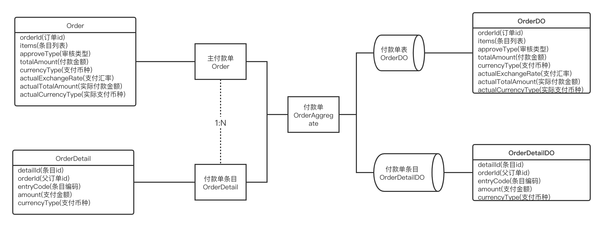
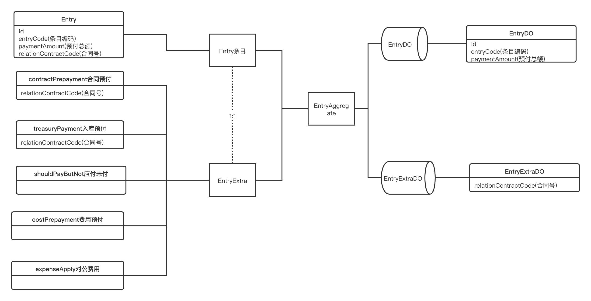

#付款单模型

##业务背景
现有合同预付、入库预付、应付未付、费用预付、对公费用5种待付款单类型。

每个付款单会有不同使用场景，且每个类型都有自身的业务规则。

##存在问题
随着业务的深入，业务规则和校验规则越来越大，导致付款单模型越来越膨胀，每个付款单类型的边界和职责越来越不清晰，导致后续人员可读性和维修性成本增加。

我们开发风格也接近以事务脚本式风格，导致可维护性差、可扩展性差、可测试性差。

一个待付款单会存在多次付款的情况，因金额或合同问题，可能需要分批分时间进行付款操作。导致待付款单和付款单的关系 存在多对多 业务理解困难，出现我也不知道的问题。

不同待付款单类型，对应的唯一KEY(合同号、订单号)不同，导致校验规则不统一。

缺少开发步骤指导、每一层的module、package的职责不明确，后续接力困难
##解决方案
 引入DDD方案，抽取付款单模型、抽取待付款单模型

 解方程步骤:
 >  先解DO -> Domain（Entity） 这一层关系

###付款单模型

###待付款单模型

###Repository实现

1.所有的 Entity/Aggregate 会被转化为 DO，然后根据业务 场景，调用相应的 DAO 方法进行操作，事后如果需要则把 DO 转换回 Entity。

2.当涉及到多 Entity 的 Aggregate Root时，需要能识别到底哪些 Entity 有变更，并且只针对那些变更过的 Entity 做操作，就需要加上变更追踪的能力。

业界有两个主流的变更追踪方案:
> + 基于 Snapshot 的方案:当数据从 DB 里取出来后，在内存中保存一份 snapshot，然后 在数据写入时和 snapshot 比较。常见的实现如 Hibernate。
> + 基于Proxy的方案:当数据从DB里取出来后，通过weaving的方式将所有setter都增 加一个切面来判断 setter 是否被调用以及值是否变更，如果变更则标记为 Dirty。在保 存时根据 Dirty 判断是否需要更新。常见的实现如 Entity Framework。

Snapshot 方案的好处是比较简单，成本在于每次保存时全量 Diff 的操作(一般用 Reflection)，以及保存 Snapshot 的内存消耗。

Proxy 方案的好处是性能很高，几乎没有增加的成本，但是坏处是实现起来比较困难，且当 有嵌套关系存在时不容易发现嵌套对象的变化(比如子 List 的增加和删除等)，有可能导致 bug。

由于 Proxy 方案的复杂度，业界主流(包括 EF Core)都在使用 Snapshot 方案。这里面还 有另一个好处就是通过 Diff 可以发现哪些字段有变更，然后只更新变更过的字段，再一次 降低 UPDATE 的成本。

###Entity实现
使用实体模型，模型里面实现业务代码和校验。 注:实体对象 不依赖任何外部服务和框架，而是纯内存中的数据和操作。这些对象我们打包为 Domain Layer(领域层)。领域层没有任何外部依赖关系。

####创建Entity方式

> + 使用 Factory 模式来降低调用方复杂度,同时创建Entity对象
> + constructor 参数要包含所有必要属性，或者在 constructor 里有合理的默认值。

